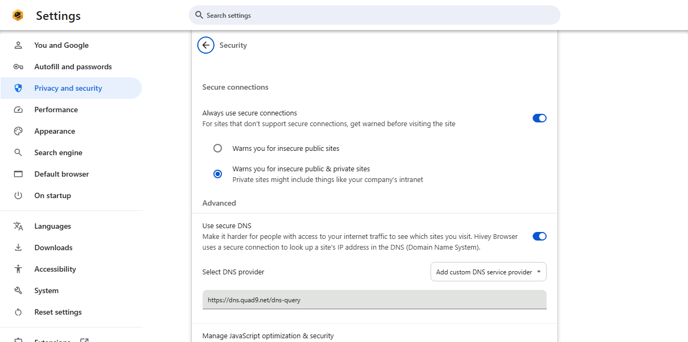
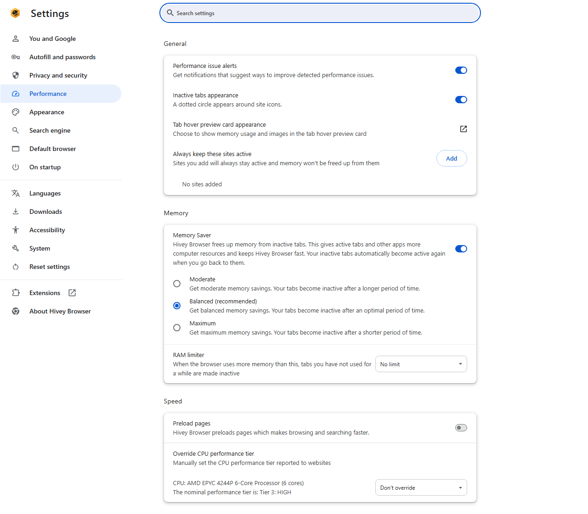

# User guide

> Hivey Browser has no public release yet. This guide describes the
> behavior of builds made from this repository.

## First start

Hivey Browser keeps its data in `%LOCALAPPDATA%\Hivey\Browser\User Data`,
separate from Chrome or Chromium. Nothing is sent anywhere at startup.

## Privacy, out of the box

These protections are on without any setup:

- **Ads and trackers blocked** on every site, with no extension. When
  something was blocked, an icon appears in the address bar; click it and
  choose *Always allow on this site* if a site breaks. All exceptions are in
  *Settings > Privacy and security > Site settings > Ads*.
- **Third-party cookies blocked.**
- **Secure connections only.** Before loading a page over plain HTTP, the
  browser shows a warning; you can continue or go back. To relax it:
  *Settings > Privacy and security > Security > Always use secure
  connections*.
- **Encrypted DNS.** The sites you visit are looked up through Quad9 over
  an encrypted connection, so your network provider cannot see them. To use
  your system's DNS instead: *Settings > Privacy and security > Security >
  Use secure DNS*.
- **Global Privacy Control.** Every site is told you do not want your data
  sold or shared.
- **Fingerprinting deception.** Small random changes to a few drawing APIs
  stop sites from recognizing your browser across visits. If a site that
  draws in a canvas (a game, an image editor) misbehaves, turn on
  `chrome://flags/#disable-fingerprinting-noise` and restart.
- **GPU hidden.** Sites using WebGL cannot read your graphics card model.
- **Private search.** Searches typed in the address bar go to DuckDuckGo.
  Pick another engine in *Settings > Search engine*.
- **No Google services, no telemetry, no crash reports.**

## Memory and performance

- **Memory Saver** is on: tabs you have not used for a while are put to
  sleep and reload when you come back to them. *Settings > Performance*
  sets how aggressive it is, and which sites always stay awake.
- **RAM limiter** (like Opera GX): *Settings > Performance > Memory > RAM
  limiter*, pick a limit (2 to 16 GB). When the browser as a whole uses more
  than that, the least recently used background tabs are put to sleep until
  it is back under the limit. Tabs playing audio or with a form being filled
  are never put to sleep this way, nor tabs you looked at in the last 10
  minutes. It checks every 30 seconds and memory figures refresh every 2
  minutes, so it is a soft limit. Measured on Windows with a 1 GB limit and
  12 news sites open: 1.23 GB, then 1.01 GB once 5 background tabs were put
  to sleep, stable afterwards.

## Colors and look

The browser uses Hivey amber by default. To change it, open a new tab,
click **Customize** (bottom right), then **Appearance**: pick a color, a
color style, light/dark/system mode, or go back to *Default*.

Scrollbars are thin and fade out when you stop scrolling (Windows 11
style). If you prefer them always visible, turn on *Windows Settings >
Accessibility > Visual effects > Always show scrollbars*; the browser follows
it.

## Advanced switches

`chrome://flags` lists every Hivey Browser and ungoogled-chromium option
(search for "Hivey" or "ungoogled").
